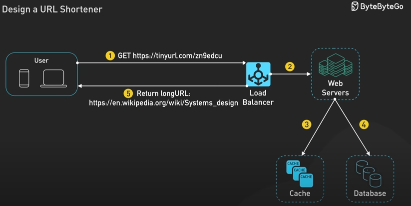

# Design-a-URL-shortener

Implement a URL shortener API. Build a system to convert long URLs into short aliases (e.g., https://example.com/article/abc123 → short.ly/xYz12). 

The system should:

- Generate unique short URLs
- Redirect short URLs to the original
- Handle a large number of requests
- Support analytics and expiry features

# API 

1. Shortening a URL

- Client sends POST /shorten with long URL
- Rate-limit API usage (throttle abuse)
- Validate URLs (well-formed, avoid internal addresses)
- Saves long URL in DB → gets unique ID
- Converts ID to short code
- Returns short.ly/{short_code}

2. Redirecting a Short URL

- Client requests GET /xYz12
- Finds original URL by short code
- Redirects using HTTP 301 or 302

## Endpoints

- POST /shorten: Shorten URL
- GET /{short_code}: Redirect to long URL

# Cache

- list of key (Shorten URL) and value (long URL) pairs

# Database

- Store mapping from short code → original URL
- Sharding SQL
- Analytics (click count)

## Database Schema

Table: url_mappings
- Field	Type	Description
- id	BIGINT (PK)	Auto-increment ID
- short_code	VARCHAR	Encoded ID (Base62)
- long_url	TEXT	Original URL
- created_at	TIMESTAMP	Time of creation
- expiry_date	TIMESTAMP	Optional expiry for short URL
- clicks	INT	Optional click counter

## References:

https://www.youtube.com/watch?v=HHUi8F_qAXM&ab_channel=ByteByteGo